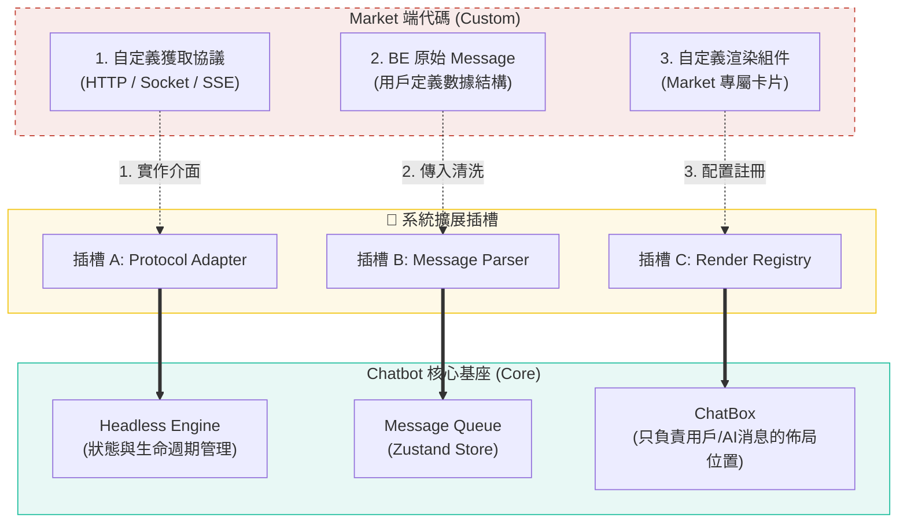
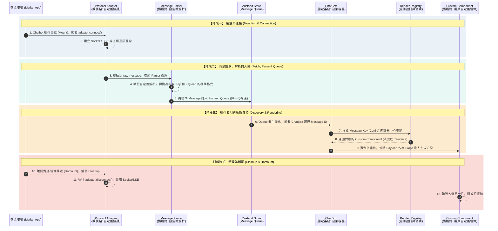

## 現狀

**1. 核心邏輯高度耦合 (High Coupling)**

- **代碼現狀**：網路請求協議 (Network Protocols)、狀態流轉與 UI 渲染程式碼完全綁死。
- **業務痛點**：牽一髮動全身。未來若要升級底層通訊 (例如從 HTTP 輪詢切換到 WebSocket)，整個對話鏈路都需要重構，Regression (回歸測試) 成本極高。

**2. 多市場 (Multi-Market) 版本維護困難**

- **代碼現狀**：不同 Market 的客製化業務邏輯，全部糅合在同一套主幹代碼中。
- **業務痛點**：極易產生「爆炸半徑」(Blast Radius)。開發 Market A 的新功能時，稍不注意就會 Break 掉 Market B 的現有功能，Release (發布) 風險高。

**3. 組件接入極度臃腫 (Hardcoded Logic)**

- **代碼現狀**：Message Render Loop (消息渲染循環) 中充斥著大量的 `if-else` 與 `switch` 判斷語句。
- **業務痛點**：擴展性差 (Poor Scalability)。每新增一種財務卡片或圖表，都必須去改動最核心的渲染文件，導致代碼迅速膨脹，維護困難。

**4. 架構僵化，喪失場景適配力 (Zero Reusability)**

- **代碼現狀**：深度依賴全局的 Layout 與 Context，默認只能作為全螢幕應用 (Standalone App) 運行。
- **業務痛點**：場景被鎖死。無法作為嵌入式組件 (Embedded Widget) 靈活整合到其他內部系統或管理後台中，沉澱的高價值資產無法跨團隊復用。

## 演進方案：Core + Templates + Custom 落地架構

本次重構的核心目標是實現 **「職責解耦 (Decoupling)」**。我們將 Chatbot 劃分為不可變的「核心基座 (Core)」與業務可自定義的「擴展插槽 (Custom)」。

## 1. 核心擴展點定義 (Extension Contracts)

系統開放三個標準插槽，Market 團隊只需按需實作以下介面，即可完成接入，無需修改基座源碼：

* 🔌 **插槽 A：Protocol Adapter (協議適配層)**
    * **職責**：接管所有的網路通訊 (Network I/O)。
    * **Market 實作**：自定義獲取消息的協議（如：**HTTP / Socket / SSE**），實作 `connect` 與 `sendMessage`。
    * **價值**：屏蔽網路層差異。基座只管調用接口，不關心底層通訊細節。
* 🔌 **插槽 B：Message Parser (消息解析層)**
    * **職責**：資料清洗與歸一化。
    * **Market 實作**：處理 **BE (後端) 返回的原始 Message** 結構。
    * **價值**：無論後端數據多複雜，都在此層清洗為系統統一的 `StandardMessage` 格式並推入 Queue，消灭 UI 層的解析邏輯。
* 🔌 **插槽 C：Render Registry (組件註冊機制)**
    * **職責**：UI 動態映射，消滅 `if-else`。
    * **Market 實作**：註冊 **Market 自定義渲染組件**，提供 `Key -> Component` 映射表。
    * **價值**：實現 UI 的熱插拔。基座根據消息 Key 自動匹配對應組件，實現動態發現。

## 2. 架構邊界與插槽映射圖

下圖展示了用戶自定義代碼與系統基座的物理邊界與交互方式：

## 3. 消息流轉生命週期 (Message Lifecycle)

數據在系統內的流轉必須嚴格遵守以下單向數據流 (Unidirectional Data Flow)

## 預期收益 (ROI) 與交付價值

## 1. Faster Time-to-Market
* **重構前**：接入新 Market 或新卡片需修改核心渲染循環，代碼衝突頻發，回歸測試 (Regression) 成本極高。
* **重構後**：基於 Render Registry 機制，各 Market 團隊只需專注開發自己的 Custom UI 並註冊。核心代碼實現「零改動」，新業務特性交付週期大幅縮短。

## 2. 消除「爆炸半徑」 (Zero Blast Radius)
* **重構前**：多 Market 邏輯糅合在巨型 `if-else` 中，A 市場的改動經常意外 Break 掉 B 市場的功能。
* **重構後**：核心基座與業務插槽物理隔離。某個 Market 的自定義卡片報錯崩潰，最多只會觸發局部的 Error Boundary，絕不會導致整個 Chatbot 白屏或波及其他 Market，線上穩定性呈指數級提升。

## 3. 組件復用 (Cross-Team Reusability)
* **重構前**：高價值圖表與組件深陷 Chatbot 狀態泥潭，無法拔出。
* **重構後**：UI 組件與獲取邏輯解綁。這些經過業務驗證的優質圖表卡片（或底層 Headless Engine），可隨時打包為獨立 Library，直接輸出給 MSD 等其他內部研發團隊，避免全公司範圍內的重複造輪子。
